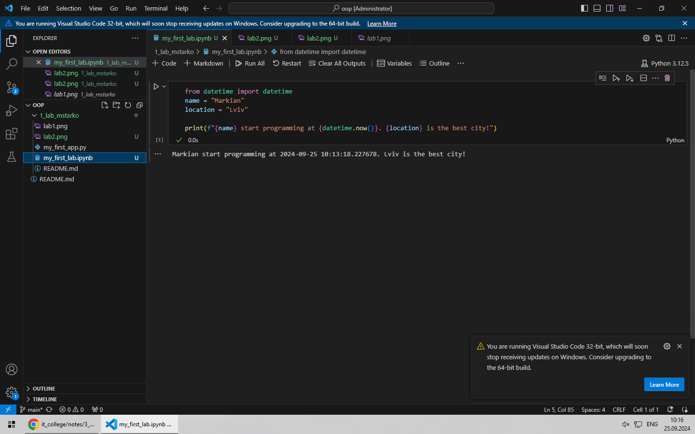

# Звіт до 1 роботи
## Тема: _Вступ, налаштування середовища_
### Мета роботи: _Налаштувати середовище виконання робіт, встановити потрібно програми, створити репозиторій на Github, навитись працювати з репозиторієм та оформити звіт до роботи за допомогою форматування Markdown_

---
### Виконання роботи
* Результати виконання завдання *1*;
    1. Розробили/виконали програму на пайтон і зробив скріншот
    1. Програма вивела значення Markian start programming at 2024-09-25 10:13:18.227678. Lviv is the best city!
    1. Навчились програму на пайтоні в форматі .pynb 
* вставлені рисунки ;

    > якщо графічних файлів багато то краще помістити їх у  окрему папку, наприклад у мене це папка `pictures`. Уважно   дивіться коли вставляєте URL - файл має бути представленим    як `raw`. А краще користуйтесь локальними шляхами!
---
### Висновок:
> у висновку потрібно відповісти на запитання:

- :question: Що зроблено в роботі; виконали програму на пайтон і зробив скріншот
- :question: Чи досягнуто мети роботи; так
- :question: Які нові знання отримано; а пайтоні в форматі .pynb 
- :question: Чи вдалось відповісти на всі питання задані в ході роботи; так
- :question: Чи вдалося виконати всі завдання; так
- :question: Чи виникли складності у виконанні завдання; ні
- :question: Чи подобається такий формат здачі роботи (Feedback);
- :question: Побажання для покращення (Suggestions);

---